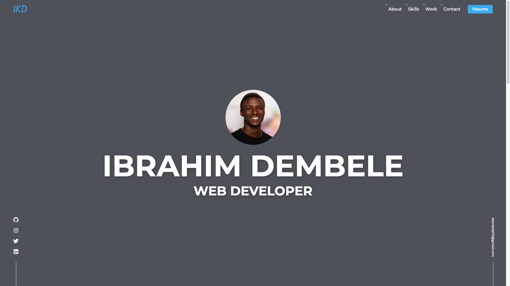

# Portfolio

Table of contents

<ol>
  <li><a href="#about-the-project" alt="About the project">about-the-project</a></li>
  <li><a href="#built-with" alt="Built With" >built-with</a></li>
  <li><a href="#authors" alt="Authors" >authors</a></li>
  <li><a href="#license" alt="License" >license</a></li>
  <li><a href="#contact" alt="Contact" >contact</a></li>
</ol>

## About the project

The aim of this project is to create a portfolio that showcases both myself and my impressive work, providing recruiters with an understanding of my existing skills, tools, and development languages and frameworks being utilized presently.

## Built With

&nbsp;&nbsp;
&nbsp;&nbsp;
&nbsp;&nbsp;
&nbsp;&nbsp;
&nbsp;&nbsp;
&nbsp;&nbsp;
[![Font Awesome](https://img.shields.io/badge/Font_Awesome-20232A.svg?style=for-the-badge&logo=data:image/png;base64,iVBORw0KGgoAAAANSUhEUgAAACgAAAAoCAYAAACM/rhtAAAACXBIWXMAAAsTAAALEwEAmpwYAAAAAXNSR0IArs4c6QAAAARnQU1BAACxjwv8YQUAAAK5SURBVHgB7VhNbtNAFH5v7HQDopaSA/gG5AZxikBi1fQETXcI0TacAHGDlCLEjuQETVdIoKbhBuYGZk0qDRIbqGceb5zUioxjmjgJVuVPih3/jOebN/Oe5vvQ6Zw5tto+I4Q6AEgE7I3fNF9DQYDV44sPSNievUlEB1enj3ppDZxnH91KZcvjAbmAsD1pAD9Iky+0Dr6/e+LDCmACJ9SDtp0kF7FGbPGpd3Nde/HZA2E3CKiD3Jbikcy0EQgkBFSPhgGPcCSUOlmGrOmLUOyDxhYiOFg7GtJfbxGMwutfB6Ky1RKAuxwpD5YAfzhApAEofT5++3iU9k60xML7dbDELnGwTABmn6cTXB98Zi3jznmZcOduVgMbNos6z0aM20RGQMGxaAR9TpQvgsC/VsoHraLpsm2bpwodEOhxmWoARCVrMwQpqo10gqEaZGRlMD0PzMHpXLq21m1C3EfKXmP/QmqSUNQhnaPWg3nZd1tMSpTwgLAxmxRm4Ly+pOaSxP+/Ch4MpER+bpkZn+40YYOoHQ4v08pZ4ZOkJJgXJcG8KAnmRUkwL0qCeVESzIs7t6OOYJRY5fc9lwTGCiy0f/qyuydhxViIYPXwos0by1ekeeOZaGnr7VgTI+l+3o3uUgRZJ3pZMhHNM2QjAK32ImTNjICCFRBcAAmyEpksr/jA2CSsU4LYOtFY5xkxctTZKMEEWQeMnTIVF3SjjWnyEDPa3r0s5tEGRomxQvumpzYG+0YOETxk08mFFWlio/r42F+IoBLYueo2M0uJ0cSW0h6TPYZlyLKiZB3eDy0xkN0duVbZacgKpTMdssgYYKdCsw7XlujJRADWmiTcWcCn7vQHzvNPdXu2uIdhIN8/DbK+sVF3Sy5haBZ/szDJluJCmAWavMkWWx8KAhFauMdRjAhF0SR6Oc/h/x/4A7U/Iys0c51SAAAAAElFTkSuQmCC)](https://github.com/)&nbsp;&nbsp;
&nbsp;&nbsp;
[![ChatGPT](https://img.shields.io/badge/ChatGPT-20232A.svg?style=for-the-badge&logo=data:image/png;base64,iVBORw0KGgoAAAANSUhEUgAAACgAAAApCAYAAABHomvIAAAACXBIWXMAAAsTAAALEwEAmpwYAAAAAXNSR0IArs4c6QAAAARnQU1BAACxjwv8YQUAAAXgSURBVHgBtVjdVdtKEJ4VznPUQZwKcCpAVAD3+UIiKsA0ENbnFgBUYAO5zzgV2LcCfCvA7kB5jvFm/iTtypItO2TO4WDLq91vZ7/5ZmYN/IbFQxtDtDqCCHr8wMAcVm6eff7nP3gjM7CHxY82AXDX+DFpGJKBgxG8mkF2YTP4DdsJIHus44b48bTlKwjUXGWf7Qj2tNYAFdwEP/bKt813WMGYj3aJfx3oAnvVpfj/Q/m264NzM3++tjRoD/DxegLlkS7w1TQ7t9Pm8dYqDTbZGOe52zRPK4Dxt2v0ANzoK/+jt5JN3FKO0vgetLMxLM1F3ZxtAb4gwC4O/4HgejjRvHbc0HbhHXrNQRquglRwQEc81SeJ/Lkjb9QMQR5XQXZgEzBa8MBdCji2UR044efqUrgGsYfsHjdka96Z8nvsabjF9w6BvC0c/+QPrPVgo4wszcfqYvG3r19wGuttgqalALCbuBVujgAzSFBO9hsBxg/XN/i0XzdZdj4oxsf/2h6K8k1lEwuUFburrCjIOYJ8T8uoI/iogyNGrg1D/uARMdFpdyaUBQc2BGcGeJy3VQ7x4gd4GhFqp3MjWEZ31TH0PX5ArxkgjY2Rxynw0QO+lk/0YNMSHAYDIGHPbco7qrOcaxQAtONza9fA0fF33AufiASZxcWfhRahBV53pkgEHd1lF4y7KcBFKCN/2xm0sOzMrmWVQmZcLjPmDr/TuA8KdIS6mkKEWSZYh06JIjvnY+7BDntOPeJsW3BrwHCjuPATLqAZBxcU7/bxf49pUFqCHH4mWjENKlPlHzoK6gvujGyRnQ1uYUfzZMYWDw1K0pm9yL/q8VscO4J3yC/nTvgHolXHncaPX2vXjTgaC4kwY9gVHPEJecX8InoQJ3Vh9Oazah14QOdCC3PMWUmnkfdz4S6e4xGvfGEtlL69OTNSXt1hFHd5cTxWjXpSgAkdO/PcB4oaiX/oHHMhQRnYrAQY2h61GwKJzCfiWR7F7KVz8hx5iQoLlBiMZjzG6yrfOHpxY4XnZdcn+bgQoHFtk3u5AAJpCirJJCb1FqiVGdqYHvu9PqLS7kkALkt3ort3BtjeSGoQANHBscxM1vjJulvwL6HfIzmW/GHpWs90A+5IJaEL+1nGAJAOys9E+FnR0SiohFI5YoMpSIxyooVwV5iXzV/AeZYl4Zm4BAAx7IMS6SD8LKxX/R2Et4TriAGq9slDcJec9kKQYywUuiK0xqgkHMIfMzMVKNAtgyQq8x8iH6qXoALUcsSVZOZWgLW0xphjhpusXW1ewCoWF9f6edFSJV0jtJmS+bjgUiVlacqbcMoL6sTWFq8BVAs9wZOz0E4ahDYRoS34+cK5mCoYDgIKviD/trQio/woy63AUywJd94bCS+OxWy90LI8kffpt1PODAicM8WO2Ukdkd9UTKOGcZlWIB+DQpXqOskIl8HGgn6ZC9fu3s26ryLYc5cVdYRpbhWO1f4j0fpuBNKMU2K/5XqOyew0uKi0grSp42tjoh4uzzIL2mQlSIqknQRAmW+DrspMPoY8RuAWWn0naw1V2XxtB0en4ke8qkolF+d8waxRkzFCmcEAMHBFwKvdG0cx9TdSuCaw0dwhlWV0KuUj5K/m97AvdtyoSCEpl0THayClYknrltrSH9/6GwCtkCG4iKLggr7P38CDWn3kQZGIF9oZ59SicM3B0VzSfAUN1UGdV3kTvWpwrd8sLEnPzIx7VKmKY4zmq8brjoJnLimdsu6JEIsryy3S0VcYN9311N8scFPO3f577zFes7kx3aDipLHcqjKRK2muvj+ubGgiQ833uq5wK0CeiHjSoeuxlkUBVcQ/ob9JZvQ2gsAJBagS39JBbr3dYm2SW4GTDcOopqTMMW6cRzz3BCU/gzuYvQEWC8j9SbVqST1hJZvi9zHfppoDA+7VoWdzKiTesvd6a7HV9rpE963lTaq/5ID1tO1oeAOTi0uvGa9fqumucKO9CUDftEjtcaSLTdvcEzbZLy0cCzYufwnFAAAAAElFTkSuQmCC)](https://openai.com/product/gpt-4)&nbsp;&nbsp;

## Authors

- I used React with Typescript and several NPM libraries to develop the application, and incorporated parts of several awesome portfolios created by others that i fell in love with. Therefore, I would like to credit all of these individuals and tools for their contributions to the project.
  <ol>
    <li><a href="https://dennissnellenberg.com/" alt="Dennis Snellenberg">Dennis Snellenberg</a></li>
    <li><a href="https://brittanychiang.com/" alt="Brittany Chiang" >Brittany Chiang</a></li>
    <li><a href="https://tamalsen.dev/" alt="tamal sen" >Tamal Sen</a></li>
    <li><a href="https://jacekjeznach.com/" alt="Jacek jeznacki" >Jacek jeznacki</a></li>
    <li><a href="https://mattfarley.ca/" alt="Matt Farley" >Matt Farley</a></li>
  </ol>

## License

&nbsp;&nbsp;

## Contact

&nbsp;&nbsp;
&nbsp;&nbsp;
&nbsp;&nbsp;

## Roadmap

- [x] Responsive
  - [x] Desktop
  - [x] Tablet
  - [x] Mobile
- [ ] Animation
  - [ ] Scroll Trigger
  - [x] Loader
- [ ] Deploy
- [x] README
